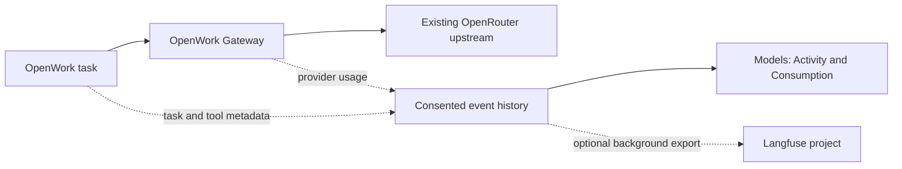

# OpenWork Models task analytics

The API and migration land first in #4567. This desktop follow-up uses that
existing API after its deployment is verified. The organization rollout capability
remains off by default, and analytics still requires explicit admin consent.

Task analytics is included with a paid OpenWork Models subscription. An internal
organization capability, `modelsAnalytics`, controls rollout and defaults to off.
After rollout, workspace admins see **Unlock custom insights** on the Models page
and can choose **Enable task analytics** or **Not now**. Purchasing or enabling
Models does not grant analytics consent.

All collection, reads and exports require the rollout capability, an active or
trialing Models subscription, Models enabled, and explicit versioned consent.
Organization members can report their own tasks; only admins can read organization
analytics and change its settings. Events are scoped to the authenticated member
and organization. Runtime events must match that member's actual Models request.

The inference path and subscription billing stay in place. This feature adds no
AI SDK, model selection or routing layer. Direct BYOK and gateway BYOK are outside
this feature. Analytics errors are isolated from model responses.

## Data and boundaries

- Immutable events preserve every reported model call, tool execution and skill
  load within a task. Stable event IDs deduplicate retries.
- Model calls contain the actual reported model/provider, timing, outcome,
  tokens, cache usage and provider-reported cost. Missing accounting stays unknown.
- The desktop follow-up adds task lifecycle and available tool, skill/version and
  MCP identifiers through the ingestion API introduced here. The event contract also accepts bounded custom scalar metadata.
  Identifier coverage depends on what the runtime exposes; task reporting is
  best effort and requires an active, signed-in desktop.
- Prompts, responses, tool arguments/results and file contents are excluded.
  Prompt classification and generated insights are not part of this version.
- Consumption is diagnostic, not a replacement for the existing billing ledger
  or subscription limits. The UI supports periods up to 90 days.

Turning analytics off stops new collection and disables export. Existing history
is retained. Deleting the workspace erases its analytics and stored integration
credentials. Re-enabling collects from the new consent time; there is no backfill
of tasks performed while off. Downgrades and rollout removal deny analytics access
without changing existing Models keys. A later eligible subscription restores
access to retained history.

Langfuse is optional. An admin tests and connects project credentials in the UI;
credentials are encrypted at rest and never returned by the settings endpoint.
Only public HTTPS destinations are supported. Each connection pins a validated
public IP while preserving the destination's TLS identity, preventing DNS rebinding.
Responses and request duration are bounded. Connecting starts export from that
time. A background outbox retries failures with stable trace/span IDs, keeping
network calls off the inference request path. Turning analytics back on does not
automatically restart export. Opt-out and disconnect wait for any already-authorized
export to finish before confirming the change; no later batch can use revoked consent.

## Rollout and upgrade proof

Apply `0092_models_task_analytics.sql` before enabling the capability. The migration
only adds two tables and their indexes. Organizations without rollout access do
not read the new tables on the inference path, so Models continues working if the
application is deployed before the migration.

Deploy the Den routes before publishing the desktop integration, then enable the
capability for selected organizations. A newer desktop receiving an unavailable
settings route keeps analytics off and leaves chat running; failed checks are cached
to avoid retrying on every streamed update.

`pnpm evals:e2e models-analytics-upgrade` runs a continuous subscriber journey with
an isolated Den database, real Gateway HTTP service, browser and desktop. Its
upstream and Langfuse witnesses use synthetic credentials. The journey starts
with an existing paid account before the analytics tables exist, applies the real
migration, and checks the same model key, consent UI, accounting, tenant/member
isolation, export, downgrade, workspace deletion and continued conversation.
An independently observed HTTP link first returns 404 for analytics settings,
proving the newer desktop still chats without uploading task events. Restoring
the endpoint then exercises live task/skill/tool reporting in the same conversation. It does not make a real
Stripe purchase or call a paid model provider.
